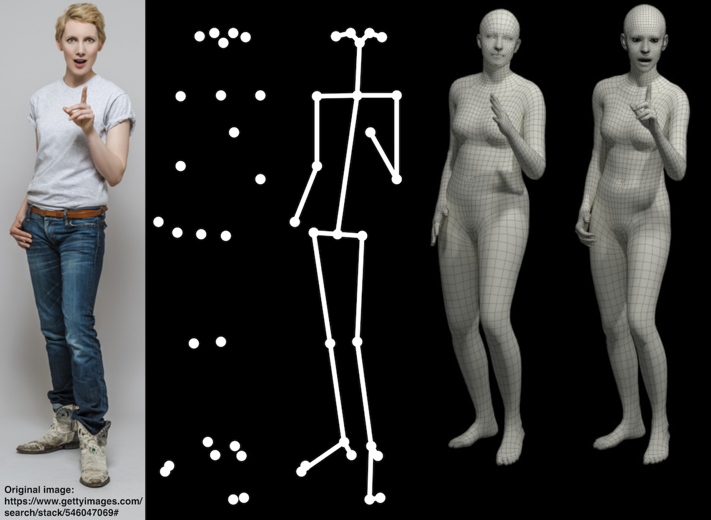
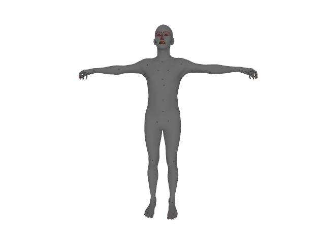

## SMPL-X:  A new joint 3D model of the human body, face and hands together

[[Paper Page](https://smpl-x.is.tue.mpg.de/)] [[Paper](https://ps.is.tuebingen.mpg.de/uploads_file/attachment/attachment/497/SMPL-X.pdf)]
[[Supp. Mat.](https://ps.is.tuebingen.mpg.de/uploads_file/attachment/attachment/498/SMPL-X-supp.pdf)]



## Table of Contents
  * [License](#license)
  * [Description](#description)
  * [Installation](#installation)
  * [Downloading the model](#downloading-the-model)
  * [Loading SMPL-X, SMPL+H and SMPL](#loading-smpl-x-smpl+h-and-smpl) 
    * [SMPL and SMPL+H setup](#smpl-and-smpl+h-setup)
    * [Model loading](https://github.com/vchoutas/smplx#model-loading)
  * [Example](#example)
  * [Citation](#citation)
  * [Contact](#contact)

## License

Software Copyright License for **non-commercial scientific research purposes**.
Please read carefully the [terms and conditions](https://github.com/vchoutas/smplx/blob/master/LICENSE) and any accompanying documentation before you download and/or use the SMPL-X/SMPLify-X model, data and software, (the "Model & Software"), including 3D meshes, blend weights, blend shapes, textures, software, scripts, and animations. By downloading and/or using the Model & Software (including downloading, cloning, installing, and any other use of this github repository), you acknowledge that you have read these terms and conditions, understand them, and agree to be bound by them. If you do not agree with these terms and conditions, you must not download and/or use the Model & Software. Any infringement of the terms of this agreement will automatically terminate your rights under this [License](./LICENSE).

## Disclaimer

The original images used for the figures 1 and 2 of the paper can be found in this link. 
The images in the paper are used under license from gettyimages.com.
We have acquired the right to use them in the publication, but redistribution is not allowed.
Please follow the instructions on the given link to acquire right of usage.
Our results are obtained on the 483 × 724 pixels resolution of the original images.

## Description

*SMPL-X* (SMPL eXpressive) is a unified body model with shape parameters trained jointly for the
face, hands and body. *SMPL-X* uses standard vertex based linear blend skinning with learned corrective blend
shapes, has N = 10, 475 vertices and K = 54 joints,
which include joints for the neck, jaw, eyeballs and fingers. 
SMPL-X is defined by a function M(θ, β, ψ), where θ is the pose parameters, β the shape parameters and
ψ the facial expression parameters.


## Installation

To install the model simply you can:
1. To install from PyPi simply run: 
  ```Shell
  pip install smplx
  ```
2. Clone this repository and install it using the *setup.py* script: 
```Shell
git clone https://github.com/vchoutas/smplx
python setup.py install
```

## Downloading the model

To download the *SMPL-X* model go to the [project website](https://smpl-x.is.tue.mpg.de/) and register to get access to the downloads section. 

## Loading SMPL-X, SMPL+H and SMPL

### SMPL and SMPL+H setup

The loader gives the option to use any of the SMPL-X, SMPL+H and SMPL models. Depending on the model you want to use, please follow the respective download instructions. To switch between SMPL, SMPL+H and SMPL-X just change the *model_path* or *model_type* parameters. For more details please check the docs of the model classes.
Before using SMPL and SMPL+H you should follow the instructions in [tools/README.md](./tools/README.md) to remove the
Chumpy objects from both model pkls, as well as merge the MANO parameters with SMPL+H.

### Model loading 

You can either use the [create](https://github.com/vchoutas/smplx/blob/c63c02b478c5c6f696491ed9167e3af6b08d89b1/smplx/body_models.py#L54)
function from [body_models](./smplx/body_models.py) or directly call the constructor for the 
[SMPL](https://github.com/vchoutas/smplx/blob/c63c02b478c5c6f696491ed9167e3af6b08d89b1/smplx/body_models.py#L106), 
[SMPL+H](https://github.com/vchoutas/smplx/blob/c63c02b478c5c6f696491ed9167e3af6b08d89b1/smplx/body_models.py#L395) and 
[SMPL-X](https://github.com/vchoutas/smplx/blob/c63c02b478c5c6f696491ed9167e3af6b08d89b1/smplx/body_models.py#L628) model. The path to the model can either be the path to the file with the parameters or a directory with the following structure:
```bash
models
├── smpl
│   ├── SMPL_FEMALE.pkl
│   └── SMPL_MALE.pkl
├── smplh
│   ├── SMPLH_FEMALE.pkl
│   └── SMPLH_MALE.pkl
└── smplx
    ├── SMPLX_FEMALE.npz
    ├── SMPLX_FEMALE.pkl
    ├── SMPLX_MALE.npz
    ├── SMPLX_MALE.pkl
    ├── SMPLX_NEUTRAL.npz
    └── SMPLX_NEUTRAL.pkl
```

## Example

After installing the *smplx* package and downloading the model parameters you should be able to run the *demo.py*
script to visualize the results. For this step you have to install the [pyrender](https://pyrender.readthedocs.io/en/latest/index.html) and [trimesh](https://trimsh.org/) packages.

`python examples/demo.py --model-folder $SMPLX_FOLDER --plot-joints=True --gender="neutral"`



## Citation

If you find this Model & Software useful in your research we would kindly ask you to cite:

```
@inproceedings{SMPL-X:2019,
  title = {Expressive Body Capture: 3D Hands, Face, and Body from a Single Image},
  author = {Pavlakos, Georgios and Choutas, Vasileios and Ghorbani, Nima and Bolkart, Timo and Osman, Ahmed A. A. and Tzionas, Dimitrios and Black, Michael J.},
  booktitle = {Proceedings IEEE Conf. on Computer Vision and Pattern Recognition (CVPR)},
  year = {2019}
}
```

Depending on your project, please consider citing as well the most relevant work(s) below:

```
    @article{SMPL:2015,
      author = {Loper, Matthew and Mahmood, Naureen and Romero, Javier and Pons-Moll, Gerard and Black, Michael J.},
      title = {{SMPL}: A Skinned Multi-Person Linear Model},
      journal = {ACM Transactions on Graphics, (Proc. SIGGRAPH Asia)},
      month = oct,
      number = {6},
      pages = {248:1--248:16},
      publisher = {ACM},
      volume = {34},
      year = {2015}
    }
```

```
  @article{MANO:SIGGRAPHASIA:2017,
      title = {Embodied Hands: Modeling and Capturing Hands and Bodies Together},
      author = {Romero, Javier and Tzionas, Dimitrios and Black, Michael J.},
      journal = {ACM Transactions on Graphics, (Proc. SIGGRAPH Asia)},
      volume = {36},
      number = {6},
      series = {245:1--245:17},
      month = nov,
      year = {2017},
      month_numeric = {11}
  }
```

```
  @article{FLAME:2017,
    title = {Learning a model of facial shape and expression from {4D} scans},
    author = {Li, Tianye and Bolkart, Timo and Black, Michael J. and Li, Hao and Romero, Javier},
    journal = {ACM Transactions on Graphics, (Proc. SIGGRAPH Asia)},
    volume = {36},
    number = {6},
    pages = {194:1--194:17},
    month = nov,
    year = {2017},
    month_numeric = {11}
  }
```

## Contact
For questions about our paper or code, please contact [Vassilis Choutas](vassilis.choutas@tuebingen.mpg.de) and [Georgios Pavlakos](pavlakos@seas.upenn.edu).
