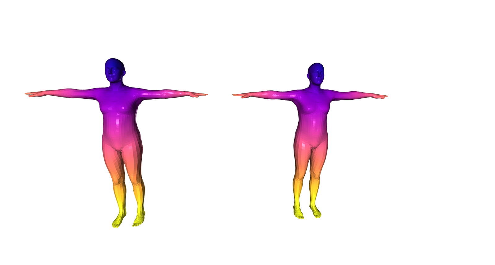

# Converting SMPL to SMPL-X

<!-- The SMPL body model [1] has been used to solve many problems, in particular -->
<!-- the estimation of 3D human pose and shape from images [2, 3, 6], videos [4, -->
<!-- 5], or even radio signals [9], generation of synthetic data [7], the creation of large -->
<!-- motion databases [8] and many other applications. SMPL however is by no means -->
<!-- the final step in human body modeling. It lacks finger -->
<!-- articulation and an expressive face. Follow-up work has addressed this issues -->
<!-- with the introduction of SMPL+H [10] and SMPL-X [11], richer models that -->
<!-- address some of the limitations of SMPL. Of course, we don't want to throw away -->
<!-- all data collected in SMPL format, which means that we need some tool to -->
<!-- convert the parameters of SMPL to SMPL-X. -->

The SMPL body model [1] is in wide use in computer vision and graphics for both
research and industrial applications. While widely used, SMPL lacks details like
articulated hands and an expressive face. The SMPL-X model [3] addresses this
and includes both the face and hands. 

Many legacy applications and datasets are built on SMPL and people want to
"upgrade" them to SMPL-X. While SMPL-X is based on the SMPL technology, they are
not completely interchangeable. 

Importantly the shape and pose parameters of SMPL and SMPL-X seem tantalizingly
similar. Sadly, you can't just take them from one model and use them with the
other. In particular, the joint locations in SMPL-X differ from those in SMPL,
meaning that the pose (theta) parameters are not interchangeable. 

Here we describe a tool to convert back and forth between the models. This
involves fitting one model to the other to recover the right parameters.

The first step in this process is to establish a mapping between SMPL and
SMPL-X, since their topologies differ. For this, we assume we have a SMPL-X
template mesh registered to the SMPL template. Now that the two surfaces match,
we compute and store the following quantities:

* For each SMPL-X vertex find the nearest point on the SMPL mesh and store:
    * The index $t_i$ of the triangle where the nearest point is located.
    * Store the barycentric coordinates of the nearest point with respect to
      the SMPL triangle $\left[a_i, b_i, c_i\right]$.

<!-- SMPL-X and SMPL share the same topology up to the neck, therefore the barycentrics of -->
SMPL-X and SMPL share the same topology up to the neck, therefore the Barycentric coordinates of
these points are a permutation of `[1.0, 0.0, 0.0]`. We also store a mask of
valid vertices, to remove points that have no match between the two meshes,
such as the eyeballs or the inner mouth. If we color-code the correspondences
we end up with the following image, where the left mesh is SMPL and the right
one is SMPL-X:

Now that we have established the correspondences between the models, we can fit
SMPL-X to the SMPL annotations. 
1. The first step is to build a mesh with the SMPL-X topology from the posed
   SMPL annotations.

   1. If $t_i$ is the index of the corresponding SMPL triangle for the i-th SMPL-X
      vertex, then let $f_i \in \mathbb{N}^3$ be the 3 indices of the SMPL vertices that
      form the triangle.
   2. Let $m_i$ be the binary mask value for the validity of this vertex.
   2. The i-th vertex is computed using the barycentrics $\left[a_i, b_i, c_i\right]$ as:

      $v_i^{SMPL-X} = a_i * v_{f_i^0}^{SMPL} + b_i * v_{f_i^1}^{SMPL} + c_i * v_{f_i^2}^{SMPL}$ 

      2. Now that we have a mesh in SMPL-X topology, we need to find the SMPL-X
      parameters, i.e. pose $\theta$, shape $\beta$, expression $\psi$  and translation $\gamma$, that best explain it.
      We use an iterative optimization scheme to
      recover the parameters:

   1. Optimize over the pose with a 3D edge term. Make sure that we only use
      the valid edges, i.e. those whose both end points are found on both
      meshes:

        $L_1\left(\theta\right) = \sum_{(i, j) \in \mathcal{E}} m_i m_j \left\lVert(v_i - v_j) - (\hat{v}_i - \hat{v}_j) \right\rVert_2^2$ 

   2. Optimize over the translation vector $\gamma$ to align the two models:

      $L_2\left({\gamma}\right) = \sum_{i} m_i \left\lVert v_i - \hat{v}_i \right\rVert$ 

   3. Optimize over all parameters, to get the tightest possible fit:

      $L_3\left((\theta, \beta, \psi, \gamma)\right) = \sum_{i} m_i \left\lVert v_i - \hat{v}_i \right\rVert_2^2$

So now, if you have data in SMPL format, you can convert it to SMPL-X. This
should allow you to use it for training.

For the inverse mapping, from SMPL-X to
SMPL, we follow a similar process to generate the correspondences and then optimize
over the SMPL parameters that best fit the
transferred mesh. Of course, if you choose to do this, you will lose all
information about the hands and the face, since SMPL is not able to model this.

For SMPL and SMPL+H [2], the process is easier, since they share the same
topology. We can therefore skip the first step, since we already know the
correspondences, compute a SMPL or SMPL+H mesh and estimate the parameters of
the other model. If we wish to transfer SMPL+H annotations, such as the AMASS
motion capture data [4], to SMPL-X, then we can use the correspondences of the
SMPL to SMPL-X mapping.

## Bibliography

[1]: Loper, M., Mahmood, N., Romero, J., Pons-Moll, G., Black, M.J.: SMPL: A
skinned multi-person linear model. ACM Transactions on Graphics (TOG) - Proceedings of ACM SIGGRAPH Asia 34(6), 248:1–248:16 (2015) 

[2]: Romero, J., Tzionas, D., Black, M.J.: Embodied hands: Modeling and capturing
hands and bodies together. ACM Transactions on Graphics (TOG) - Proceedings
of ACM SIGGRAPH Asia 36(6), 245:1–245:17 (2017)

[3]: Pavlakos, G., Choutas, V., Ghorbani, N., Bolkart, T., Osman, A.A.A., Tzionas,
D., Black, M.J.: Expressive body capture: 3D hands, face, and body from a single
image. In: Proceedings of the IEEE Conference on Computer Vision and Pattern
Recognition (CVPR). pp. 10967–10977 (2019)

[4]: Mahmood, N., Ghorbani, N., Troje, N.F., Pons-Moll, G., Black, M.J.: Amass:
Archive of motion capture as surface shapes. ICCV (2019) 
